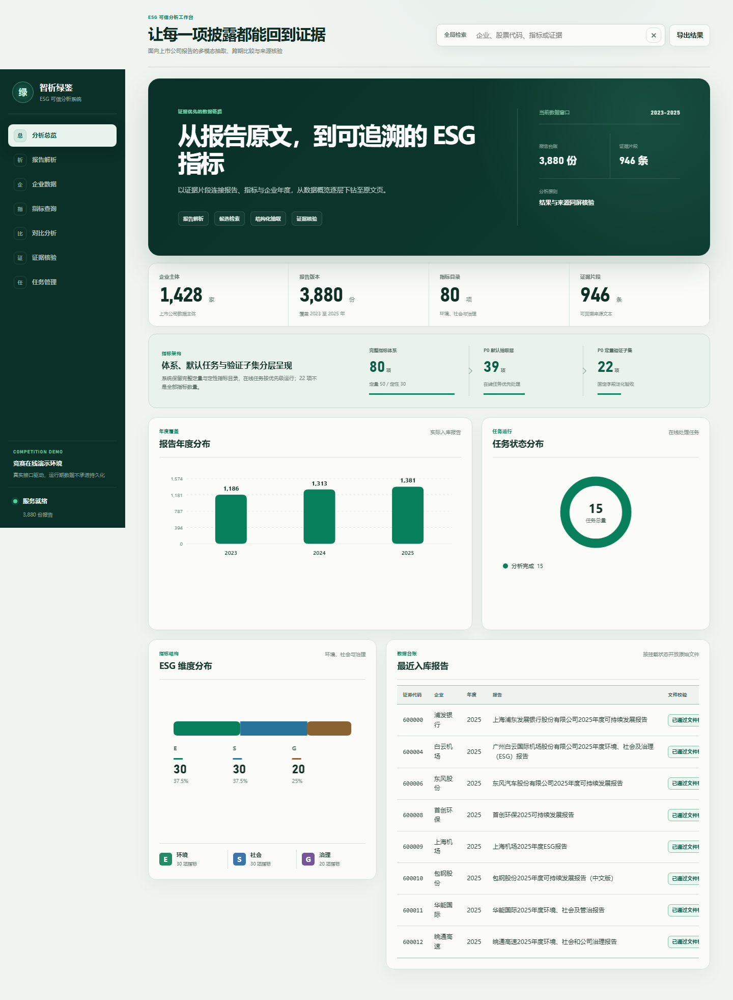
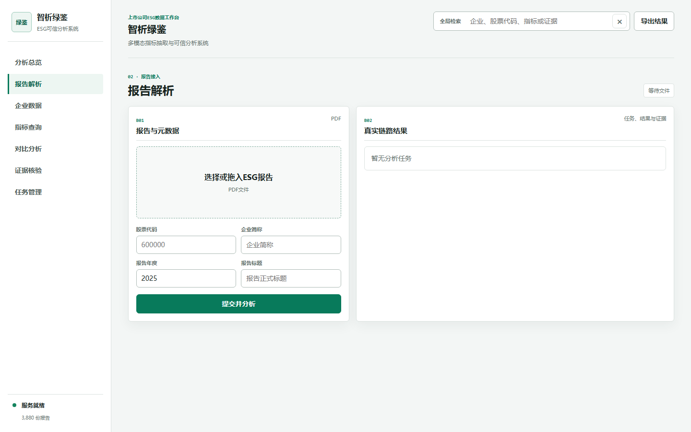
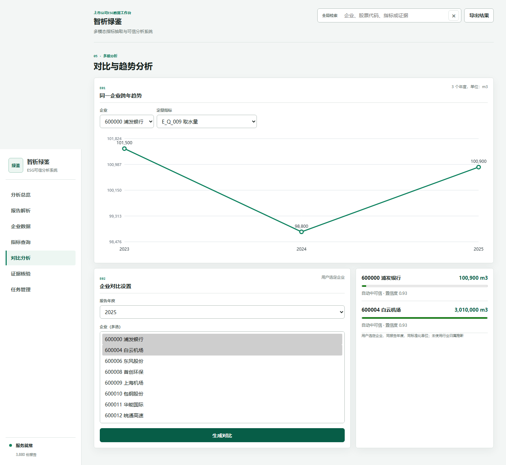

# 智析绿鉴

**面向上市公司 ESG 报告的多模态指标抽取与可信分析系统**

本项目面向上市公司 ESG、可持续发展、社会责任和环境报告，提供报告登记与上传、定量与定性指标抽取、原文证据回溯、跨年度趋势分析、企业对比和结构化结果导出。系统采用“规则与表格优先、OCR 条件路由、大模型按需补充、证据守卫统一验收”的分层处理方式，默认确定性链路无需外部模型密钥即可运行。

## 已实现能力

- 80 项 E/S/G 指标目录，区分定量、定性、单位、年度和披露状态。
- PDF 文本与表格解析、扫描页 OCR 条件路由、候选生成和单位规范化。
- 页码、原文片段、来源类型、置信度、风险标记和复核状态组成的证据链。
- 报告上传、异步任务、结果查询、证据检索、趋势分析、企业对比和 CSV 导出。
- SQLite 演示数据库与持久化运行目录，可在后续上传报告时增量扩展。
- Flask 同源服务、响应安全头、上传限制、参数校验、文件哈希去重和异常输入防护。

## 数据与验收事实

以下数字均来自仓库内可复核产物，不把自动验收状态解释为人工金标准确率：

| 项目 | 已验收结果 | 适用边界 |
|---|---:|---|
| 三年报告元数据 | 3,880 份、1,428 家公司 | 2023—2025 年元数据盘点 |
| 自动入库判定 | 3,875 份通过、5 份待复核 | 文件与元数据规则，不代表指标抽取正确率 |
| 三年可比报告集 | 177 家公司、531 份报告 | 每家公司每年各 1 份，文件哈希可复核 |
| 指标目录 | 80 项 | E/S/G 定量与定性指标 |
| 在线演示种子 | 5 家公司、15 份报告 | 按股票代码预先固定的功能演示样本 |
| 演示种子结果 | 1,164 行结果、946 条候选、946 条证据 | 不作为人工金标测试集 |
| 可比时间序列 | 52 组 | 同企业、同指标、至少两年、同规范单位 |
| 异常输入验收 | 14/14 通过 | 接口参数、文件、去重与数据库防护 |
| 查询效率验收 | 10 类接口完成计时 | 单进程本机顺序测试，不代表公网延迟 |

算法迁移回归覆盖 5 份报告、195 个 P0 字段槽位和 47 个流水线步骤，关闭外部大模型后全部步骤正常完成。该结果用于验证工程迁移一致性，不用于宣称未知报告上的准确率。

## 系统结构

```text
浏览器
  └─ Flask API 与静态前端
       ├─ 数据服务：企业、报告、指标、结果、证据与趋势查询
       ├─ 任务执行器：上传队列、状态机、超时与失败留痕
       ├─ 可信抽取引擎：文本/表格 → OCR 路由 → 候选 → 证据守卫
       └─ SQLite：公开演示种子 + 增量运行数据
```

## 界面预览

### 分析总览



### 报告上传与解析



### 趋势分析与企业对比



## 本地运行

建议使用 Python 3.11 或 3.12：

```powershell
python -m venv .venv
.\.venv\Scripts\python -m pip install -r .\算法源码\依赖环境清单.txt
.\.venv\Scripts\python .\算法源码\检查运行环境.py
.\.venv\Scripts\python .\平台服务\平台接口.py
```

浏览器访问 `http://127.0.0.1:8000`。首次启动会从只读演示种子复制运行数据库，后续上传和分析均写入运行目录，不修改种子文件。

## Docker 运行

```bash
docker compose up --build
```

浏览器访问 `http://127.0.0.1:8000`。`esg_runtime` 卷保存运行数据库、上传文件、分析任务和 OCR 缓存；删除容器不会删除该卷。

## 关键环境变量

| 变量 | 说明 | 默认值 |
|---|---|---|
| `ESG_PLATFORM_HOST` | 监听地址 | `127.0.0.1` |
| `ESG_PLATFORM_PORT` | 服务端口 | `8000` |
| `ESG_PLATFORM_RUNTIME_DIR` | 增量运行数据目录 | 项目内运行目录 |
| `ESG_PLATFORM_MAX_UPLOAD_BYTES` | 单文件上传上限 | `31457280` |
| `ESG_PLATFORM_JOB_TIMEOUT_SECONDS` | 单任务超时秒数 | `7200` |
| `DEEPSEEK_API_KEY` | 条件启用的大模型密钥 | 空 |
| `CLAUDE_API_KEY` | 条件启用的视觉模型密钥 | 空 |

真实密钥只应通过部署平台的加密环境变量注入，禁止提交到仓库。完整变量示例见 `.env.example`。

## 接口入口

- `GET /api/v1/health`：健康状态与数据库完整性。
- `GET /api/v1/summary`：平台统计概览。
- `POST /api/v1/reports`：登记或上传报告。
- `POST /api/v1/jobs`：创建真实抽取任务。
- `GET /api/v1/jobs/<job_id>`：查询任务进度。
- `GET /api/v1/results`：查询结构化抽取结果。
- `GET /api/v1/results/<result_id>/evidence`：查询结果证据链。
- `GET /api/v1/trends`：查询企业跨年度指标序列。
- `GET /api/v1/compare`：查询同年同单位企业对比。
- `GET /api/v1/exports/results.csv`：导出结果。

## 事实边界

系统中的 `auto_verified_high`、`auto_verified_medium` 等状态表示预设机器规则下的自动验收等级；`candidate_found` 表示发现候选证据。二者都不等同于人工金标“正确”。准确率、召回率和 F1 只能引用独立标注与评估产物，不能由平台状态或披露评分反推。

演示数据库不包含原始报告 PDF。公开部署可浏览结构化演示结果和证据元数据；上传新报告后，系统在持久化运行目录中保存报告与分析产物。生产使用时还应增加身份认证、对象存储、数据库备份和任务队列隔离。

## 复核入口

- 算法使用说明：`算法源码/README.md`
- 平台运行说明：`平台服务/平台运行说明.md`
- 数据库结构说明：`数据库/README.md`
- 三年数据与平台验收摘要：`文档/三年动态平台验收事实摘要.md`
- 测试证据：`测试证据/`

